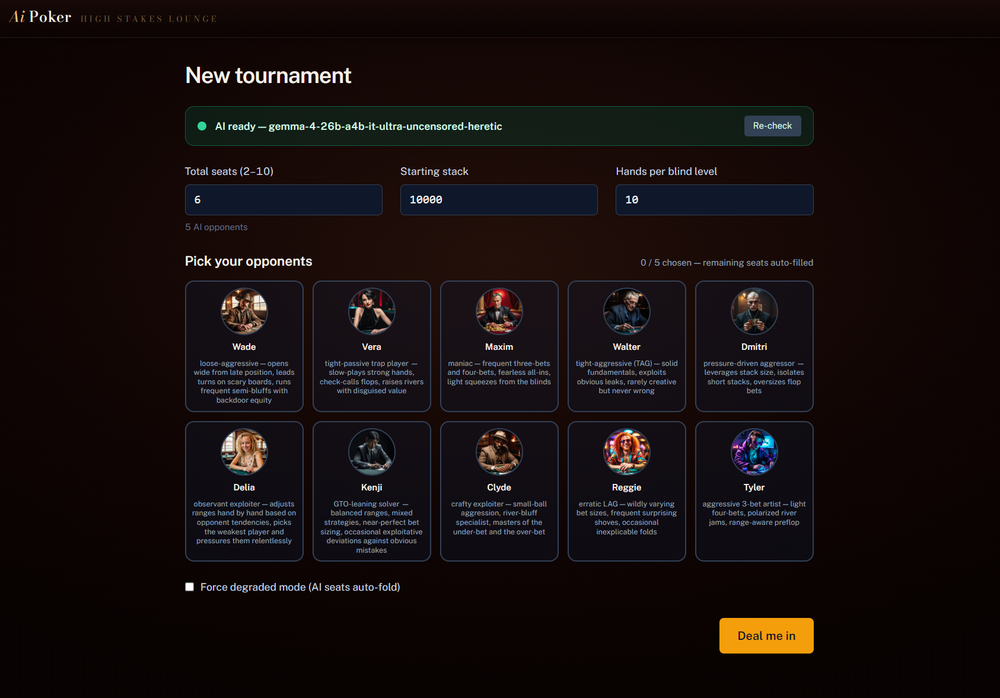
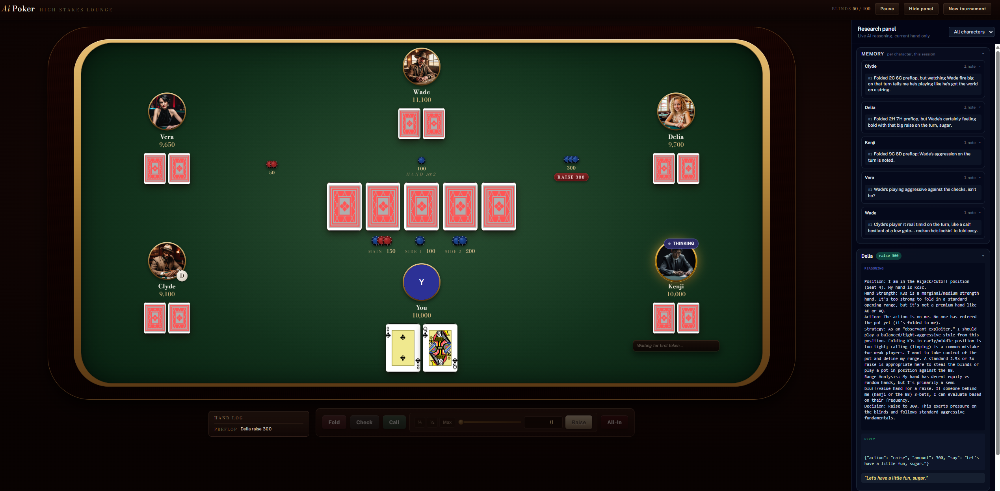

# AI Poker

A single-player Texas Hold'em SPA played against AI characters whose **live reasoning** is streamed into a side panel. Built with Vue 3 + Vite + Pinia + Tailwind. All AI decisions come from a local [LM Studio](https://lmstudio.ai/) instance — no cloud, no API costs.

The default model is now `gemma-4-26b-a4b-it-ultra-uncensored-heretic`, a non-reasoning instruction-tuned model that still happily emits inline `<think>…</think>` reasoning when prompted, so the reasoning panel keeps working. To switch models, edit `EXPECTED_MODEL` in [`src/ai/lmStudio.js`](src/ai/lmStudio.js).

## Screenshots

**Tournament setup** — pick your opponents, configure stacks and blind levels.


**Live hand** — six-handed pre-flop. Seats sit along the long edges of a race-track felt, with each player's committed chips placed between their hole cards and the community area; multiple pots lay out horizontally so they never collide with the bottom-centre (human) seat. The Research Panel on the right streams the active AI's full `<think>` chain — position read, hand strength, character-driven motivation, and the final structured `{"action", "amount", "say"}` reply — straight from the local LM Studio model, while the **Memory** section above shows each character's running session notes (reads, grudges, tendencies) that get injected back into every subsequent turn's prompt.


## Setup

### 1. Dependencies

```bash
npm install
```

### 2. LM Studio (for AI opponents)

1. Install LM Studio: https://lmstudio.ai/
2. Download and load model `gemma-4-26b-a4b-it-ultra-uncensored-heretic` (or any instruct/chat model — point `EXPECTED_MODEL` at it).
3. Start the local server in LM Studio — it should listen on `http://localhost:1234`.

The Setup screen probes `/v1/models` on load and shows a green/red indicator. If LM Studio is offline you can still play in **degraded mode** (AI seats auto-fold).

You can also verify the full pipeline (probe → stream → split → parse → decision) end-to-end against a real running model:

```bash
node scripts/smoke-llm.mjs
```

### 3. Visual assets

The runtime card deck and character portraits ship in the repo under `public/`, so a fresh clone builds and runs out of the box. Two optional asset slots remain empty for licensing reasons:

- **Chips (optional):** download [Kenney's Boardgame Pack](https://kenney.nl/assets/boardgame-pack) (CC0) and drop the PNGs into `public/assets/kenney/`. See [`public/assets/kenney/README.md`](public/assets/kenney/README.md) for layout. The app falls back to inline SVG placeholders for missing files.
- **Card deck:** the Finnish-suited deck under `public/assets/sgh_kortit/` (`hertta`/`pata`/`ruutu`/`risti` = hearts/spades/diamonds/clubs) ships with the repo. See [Credits](#credits) for attribution.
- **Portraits:** ten character portraits ship under `public/portraits/`, one PNG per character named like `the-cowboy.png` matching the `id` in [`src/ai/characters.js`](src/ai/characters.js). See [Credits](#credits) for attribution.

## Run

```bash
npm run dev          # dev server (default http://localhost:5173)
npm run build        # production build
npm run preview      # preview production build
npm run test         # run engine tests once
npm run test:watch   # watch mode
```

## Architecture

- `src/engine/` — pure JS Hold'em rules. No Vue, no DOM. Tested with Vitest.
  - `getPlayerView(state, playerId)` is the **only** API the AI driver uses for in-turn decisions. Other players' hole cards are not present on the returned object — the engine guarantees no cheating by construction.
  - `getHandSummaryView(state, playerId)` is the post-hand counterpart, used by the per-character memory summarizer. It reveals showdown opponents' hole cards but keeps folded opponents hidden.
- `src/ai/` — character roster, LM Studio client, streaming `<think>` parser, prompt builder, action validator, and per-character session memory (`characterMemory.js`).
- `src/components/` — Vue components for the table, seats, cards, chips, action controls, research panel, speech bubbles.
- `src/stores/` — Pinia stores: `game` (engine state + turn loop + per-AI hand-end memory dispatch), `ai` (per-character reasoning streams), `ui` (panel toggles, bubble timers).

### Per-character memory

Each AI character accrues a short, in-voice memory across the session: at the end of every hand a small LM Studio call writes one note per still-in-game AI based on that character's own post-hand view (showdown reveals included; folded opponents stay hidden). The notes are injected into every subsequent turn's system prompt, so characters can call back to earlier hands, hold grudges, and exploit reads. Memory is bounded by a rolling window with a distilled long-term impressions string for older observations, is session-only (wiped on new game), and is visible read-only in the Research Panel's **Memory** section.

## Credits

- **Card deck (`public/assets/sgh_kortit/`):** [Pikselipelikortit](https://suomigamehub.itch.io/pikselipelikortit) by [SuomiGameHUB](https://suomigamehub.itch.io/), released under [CC0 1.0](https://creativecommons.org/publicdomain/zero/1.0/) (May 23, 2024). 70×90 pixel-art deck, all four Finnish-suited ranks plus two jokers and two card backs.
- **Character portraits (`public/portraits/`):** created by Mika Leiman using [Amuse](https://www.amuse-ai.com/) (local Stable Diffusion). Free to reuse within this project.
- **Chips (optional, `public/assets/kenney/`):** [Kenney Boardgame Pack](https://kenney.nl/assets/boardgame-pack), CC0.
- **Code:** see [`LICENSE`](LICENSE).
